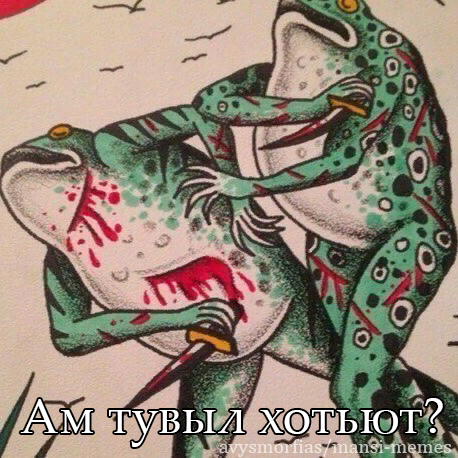
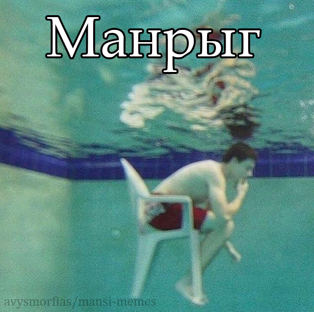

<h1 align="center">Mansi Memes</h1>

<p align="center">
  <b>Legu en:</b>
  <a href="https://github.com/avysmorfias/mansi-memes/blob/main/README.md">English</a> |
  <a href="https://github.com/avysmorfias/mansi-memes/blob/main/README.ru.md">Русский</a>
</p>

**Mansi Memes** estas kolekto de memeoj en la mansia lingvo.

La ideo estas simpla: mi prenas vortojn kaj esprimojn el mansiaj vortaroj, libroj kaj aliaj lernmaterialoj kaj metas ilin en konatajn interretajn formatojn — de simplaj ŝercoj ĝis ekrankopioj el Minecraft.

La projekto estas malgranda provo montri la mansian lingvon en loko, kie oni eble ne atendus ĝin vidi: ne nur en vortaroj, arkivoj kaj lingvistikaj publikaĵoj, sed ankaŭ en memo, kiun oni povas sendi al amiko.

## Kial?
Oni kutime renkontas la mansian lingvon per vortaroj, sciencaj publikaĵoj, arkivoj kaj lernmaterialoj. Mi volis fari ion multe malpli seriozan per ĝi: preni vortojn kaj esprimojn el tiuj materialoj kaj meti ilin en tiun interretan kulturon, kiun mi mem renkontas ĉiutage.

Ekrankopio el Minecraft kun mansia teksto povas ŝajni tre eta afero. Ĝuste tio plaĉas al mi. Ĝi montras, ke la mansia lingvo povas esti uzata ne nur en materialoj pri la lingvo mem, sed ankaŭ por fari ŝercon, sendi mesaĝon al amiko kaj simple aperi en la interreto.

Mi ankaŭ esperas, ke la projekto vekos ĉe iu intereson pri la mansia lingvo — aŭ inspiros iun fari ion similan per sia propra lingvo.

> Ie en Siberio ekzistas lingvo, en kiu oni povas fari Minecraft-memeon.

## Kial Esperanto?
La angla estas ĉi tie por ke la projekto estu alirebla por internacia publiko. La rusa estas natura por ĉi tiu projekto, ĉar granda parto de la materialoj pri la mansia lingvo, kun kiuj mi laboras, estas en la rusa.

Esperanto havas alian celon. Ĝi helpas montri la projekton al homoj, kiuj jam interesiĝas pri lingvoj kaj lingva diverseco, sed eble neniam antaŭe renkontis la mansian lingvon.

Tial Esperanto ĉi tie ne estas simple alia lingvo por tradukoj. Ĝi estas malgranda ponto inter la internacia lingvokomunumo kaj malgranda indiĝena lingvo de Siberio.

**Mansi → Esperanto → pli vasta mondo.**

## Kio estas ĉi tie?
En la deponejo troviĝas mansiaj memeoj, la esprimoj uzataj en ili, tradukoj, informoj pri iliaj fontoj kaj strukturitaj datumoj.

Nuntempe la kolekto enhavas materialojn el pluraj mansiaj lingvovariaĵoj, inkluzive de la Sosva kaj Supra-Lozva variaĵoj. Dum aperos novaj materialoj, eblos aldoni ankaŭ aliajn variaĵojn.

La kolekto estas intence malgranda. Ĝi ne celas fariĝi kompleta vortaro, korpuso aŭ akademia datumbazo. Ĝi estas kreskanta kolekto de aferoj, kiujn mi trovas interesaj, amuzaj kaj indaj je kundivido.
## Kiel ĝi funkcias
Mi trarigardas mansiajn vortarojn, frazeologiajn vortarojn, lernolibrojn kaj aliajn materialojn, trovas vortojn kaj esprimojn, kiuj povas bone funkcii en memo, kaj kreas surbaze de ili la bildon.

La originala mansia esprimo estas konservata kune kun tradukoj al la angla, rusa kaj Esperanto. La fonto de la esprimo ankaŭ estas indikita, por ke oni povu, se necese, trovi la vortaron, libron, lecionon aŭ alian materialon, el kiu ĝi estis prenita.

Parto de la materialoj devenas de malnovaj presitaj libroj, kiujn estas malfacile trovi ekster specialigitaj kolektoj. Mi ankaŭ uzas pli novajn ciferecajn materialojn, inkluzive de retaj lecionoj pri la mansia lingvo kaj aliaj rimedoj.

La plena informo pri la fontoj troviĝas en [`data/sources.json`](./data/sources.json).
## Datumoj
La kolekto estas ankaŭ konservata kiel strukturitaj JSON-datumoj en [`data/memes.json`](./data/memes.json).

Ĉiu elemento ligas la mansian esprimon, ĝian variaĵon, tradukojn, fonton kaj la koncernan memobildon.

Ekzemple:
```json
{
  "id": 1,
  "expression": {
    "text": "Ам тувыл хотьют?",
    "language": "mns",
    "variety": "sosva"
  },
  "translations": {
    "en": "Me and who?",
    "ru": "Я и кто?",
    "eo": "Mi kaj kiu?"
  },
  "sources": [
    "valdazs-untuy-erzyanin-lesson-1"
  ],
  "meme": {
    "image": "memes/sosva/me-and-who.png"
  }
}
```

JSON ne estas la ĉefa celo de la projekto, sed ĝi faciligas prizorgi la kolekton kaj reuzi ĝin. La datumoj ankaŭ povas esti uzataj por malgrandaj lingvistikaj eksperimentoj, skriptoj kaj aliaj projektoj bazitaj sur ĉi tiu kolekto.

## Galerio
<div align="center">



<p align="center"><i>«Ам тувыл хотьют?» — «Mi kaj kiu?»</i></p>

<br>



<p align="center"><i>«Kial?»</i></p>

</div>

La galerio estas la koro de la projekto. La celo ne estas nur kolekti mansiajn esprimojn, sed ankaŭ vere meti ilin en modernan vidan kaj humuran kuntekston.

## Ĉu vi havas ion, kion mi ne havas?
Granda parto de tio, kio interesas min en ĉi tiu projekto, estas la serĉado de mansiaj materialoj, kiujn estas malfacile trovi.

Se vi havas mansian vortaron, lernolibron, sonregistraĵon, tradukon aŭ alian maloftan materialon, kiu povus helpi trovi novajn vortojn kaj esprimojn, mi tre ĝojus aŭdi pri ĝi.

Vi ankaŭ povas helpi la projekton, se vi:

* rimarkis eraron en esprimo aŭ traduko;
* havas ideon por mansia memo;
* volas proponi memŝablonon;
* volas aldoni vian propran memeon en la mansia lingvo;
* konas iun, al kiu ĉi tiu projekto povus interesi.

Por korektoj, proponoj kaj kontribuoj vi povas uzi [GitHub Issues](https://github.com/avysmorfias/mansi-memes/issues) aŭ skribi al mi rekte: **[beeressence@gmail.com](mailto:beeressence@gmail.com)**.

## Permesilo kaj kopirajto
Originalaj materialoj kreitaj por ĉi tiu deponejo, inkluzive de propraj tradukoj, priskriboj kaj aliaj originalaj tekstoj kaj datumoj, estas distribuitaj laŭ la [CC BY-NC-SA 4.0](https://creativecommons.org/licenses/by-nc-sa/4.0/) permesilo.

La mansiaj esprimoj kaj aliaj lingvaj materialoj devenas de vortaroj, libroj, lecionoj, registraĵoj kaj aliaj fontoj listigitaj en [`data/sources.json`](./data/sources.json). Triaj bildoj uzataj en la memeoj ne estas kovritaj de ĉi tiu permesilo.

Bildoj kreitaj de la aŭtoro de la deponejo, ekzemple propraj fotoj aŭ ekrankopioj, ankaŭ ne estas kovritaj de ĉi tiu permesilo, krom se al ili aparte estas indikita alia permesilo.

La plena informo pri permesiloj kaj kopirajto troviĝas en [`LICENSE`](./LICENSE).
