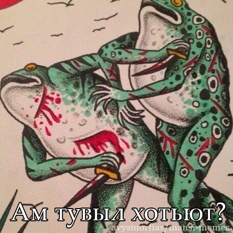
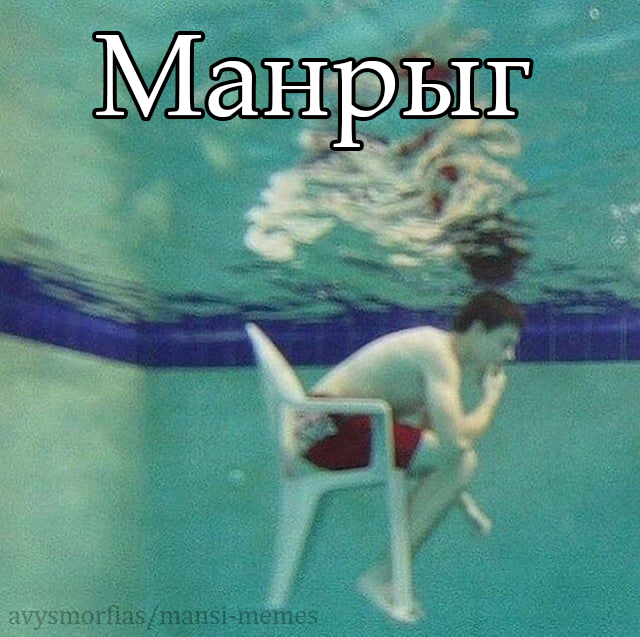

<h1 align="center">Mansi Memes</h1>

<p align="center">
  <b>Read in:</b> 
  <a href="https://github.com/avysmorfias/mansi-memes/blob/main/README.md">English</a> | 
  <a href="https://github.com/avysmorfias/mansi-memes/blob/main/README.eo.md">Esperanto</a>
</p>

**Mansi Memes** — это коллекция мемов на мансийском языке, оформленная в виде мультиязычного датасета для обучения и лингвистических экспериментов. Проект направлен на поддержку одного из исчезающих языков коренных народов Сибири через современные цифровые форматы.

## Зачем это нужно?
Мемы — это отличный способ передачи живого языка. Через формат мемов я хочу поддержать интерес к мансийской культуре и языку, которому грозит исчезновение, сделав его изучение актуальным для интернета.

## Как это работает?
Я изучаю сканы архивных словарей и учебников, оцифровываю лексику в личную базу данных и на её основе создаю мемы. Каждый мем я сопровождаю переводом на русский, английский и эсперанто.

### Почему Эсперанто?
> Русский и английский необходимы для региональной и международной аудитории. Эсперанто же я использую как нейтральный инструмент общения и способ объединить сообщества лингво-энтузиастов.

## Возможности использования
Проект может быть полезен для:
- Изучения мансийского языка через мемы
- Анализа идиом и выражений.
- Создания небольших языковых инструментов и экспериментов  
- Создания лингвистических инструментов и NLP-экспериментов.

## Структура данных (JSON)
Все мемы описаны в формате [JSON](https://github.com/avysmorfias/mansi-memes/blob/main/memes.json). Это позволяет автоматизировать обработку данных и использовать их в сторонних приложениях.

**Пример структуры:**
```json
{
      "id": "1",
      "phrase": "Ам тувыл хотьют?",
      "dialect": "sosva",
      "level": "basic",
      "tags": ["mem", "ironic", "absurd", "relatable", "friendship", "conflict"],
      "image": {
        "filename": "me-and-who.png"
      },
      "translation": {
        "sosva": "Ам тувыл хотьют?",
        "en": "Me and who?",
        "ru": "Я и кто?",
        "eo": "Mi kaj kiu?"
      }
    }
```

## Используемые материалы
Я собираю и использую следующие словари и учебные материалы по мансийскому языку:
- **Краткий мансийско-русский словарь** — `Чернецов, Чернецова` 1936 (4000 слов)
- **Мансийско-русский словарь** — `Баландин, Вархушев` 1958
- **Словарь мансийско-русский и русско-мансийский** — `Ромбандеева, Кузакова` 1982 (4000 слов)
- **Букварь на мансийском (вогульском) языке** — `Черенцова` 1983
- **Мансийско-русский словарь** (Кондинский диалект) — `Кузакова` 2001
- **Русско-мансийский словарь** — `Ромбандеев` 2005 (11 000 слов)
- **Практический курс мансийского языка. Часть 2** - `Скрибник` 2007
- **Мансийско-русский словарь** (верхне лозвиньский диалект) — `Бахтиярова, Динисламов` 2016 (2000 слов)
- **Краткий мансийско-русский словарь** (для учащихся 1-4 классов) — `Кумаев` 2019 (800 слов)
- **Картинный фразеологический словарь мансийского языка** — `Динисламова` 2020
- **Словарь топонимов мансийского языка** — `Слинкина` 2024

> **Есть другие книги или редкие материалы?** Буду рад любой помощи: beeressence@gmail.com!

## Галерея

<div align="center">

  
<p align="center">"Me and who?" / "Я и кто?" / "Mi kaj kiu?"</p>

  
<p>"Why" / "Почему" / "Kial"</p>

</div>

## Как помочь проекту?
- **Ставьте ⭐ (Star)** — это помогает проекту стать заметнее.
- **Обсуждайте:** предлагайте идеи или исправления через [Issues](https://github.com/avysmorfias/mansi-memes/issues).
- **Делитесь:** присылайте шаблоны мемов или помогайте с переводами.
- **Изучайте:** просто используйте эти материалы для знакомства с языком!

## Лицензия и авторское право

**Изображения:** В проекте используются популярные интернет-шаблоны. Если вы являетесь правообладателем изображения, пожалуйста, свяжитесь со мной.

**Тексты и переводы:** Принадлежат [avysmorfias](https://github.com/avysmorfias) и распространяются по лицензии [CC BY-NC-SA 4.0](https://creativecommons.org/licenses/by-nc-sa/4.0/).